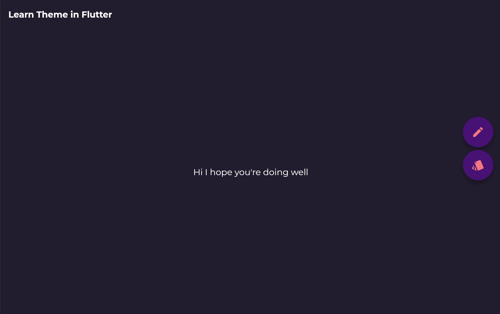
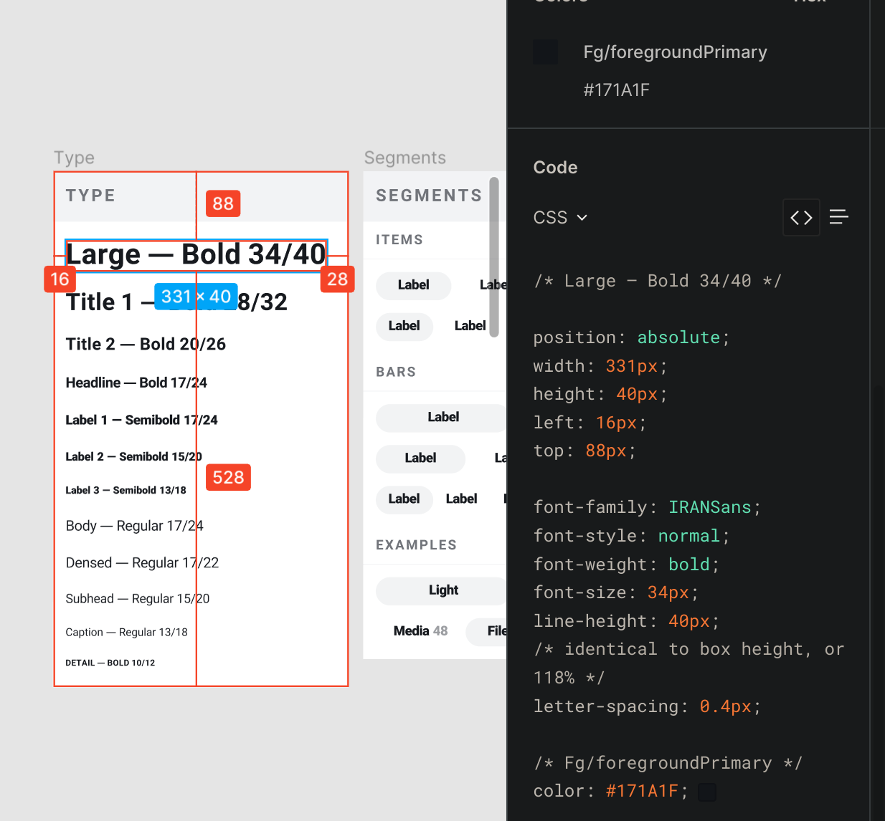

# learn_flutter_theme

در این پروژه استفاده از تم های مختلف در فلاتر رو یاد میگیریم

آدرس وب اپ پروژه :

https://app.yazdi.dev/learn_flutter_theme/

### این پروژه در مورد چیست ؟

در این پروژه دو مبحث تم و بومی سازی به معنای پشتیبانی از زبان ها مختلف و راست چین یا چپ چین بودن با توجه با زبان انتخابی برنامه مورد بررسی قرار میگیرد . همچنین برنامه شامل دو تم تاریک و روشن و همچنین پشتیبانی از دو زبان فارسی و انگلیسی میباشد. 

### چگونه میتوانیم ظاهر برنامه را با توجه به تم انتخاب شده عوض کنیم ؟

راه های مختلفی برای دسترسی به وضعیت فعلی تم وجود دارد 
- استفاده از `InheritedWidget`
- استفاده از یک `provider` برای مدیریت وضعیت تم
- استفاده از `setState`

در این پیاده سازی ما از `InheritedWidget` استفاده میکنیم .
```dart
class _ModelBindingScope extends InheritedWidget {
  const _ModelBindingScope({
    Key? key,
    required this.modelBindingState,
    required Widget child,
  }) : super(key: key, child: child);

  final _ModelBindingState modelBindingState;

  @override
  bool updateShouldNotify(_ModelBindingScope oldWidget) => true;
}
```

و از این ویجت به عنوان والد ویجت `MaterialApp` استفاده میکنیم.
```dart
ModelBinding(
  initialModel: OurOptions(
    themeMode: ThemeMode.system,
    textScaleFactor: systemTextScaleFactorOption,
    platform: defaultTargetPlatform,
  ),
  child: Builder(
    builder: (context) {
      return MaterialApp(
        home: const OurHomePage(),
      );
    },
  ),
);
```

### چگونه تم تاریک و روشن بسازیم ؟

این کار به راحتی با ساخت یک کلاس و همچنین تعریف properties های آن با توجه دیزاین مورد نظر قابل انجام است .
برای مثال عکس زیر یک نمومه دیزاین در محیط figma است :


در این قسمت ما با دو راه روبه رو هستیم :
- ساخت کل `MaterialTheme` با تمام ویژگی های آن
- استفاده از `copyWith` و تغییر ویژگی های مورد نیاز

که در این پیاده سازی از روش دوم استفاده شده :

```dart
static const _lightFillColor = Colors.black;
static const _darkFillColor = Colors.white;

static final Color _lightFocusColor = Colors.black.withOpacity(0.12);
static final Color _darkFocusColor = Colors.white.withOpacity(0.12);

static final ThemeData _lightThemeData = ThemeData.light();
static final ThemeData _darkThemeData = ThemeData.dark();

static ThemeData lightThemeData(BuildContext context) =>
  themeData(_lightThemeData, context, lightColorScheme, _lightFocusColor);

static ThemeData darkThemeData(BuildContext context) =>
  themeData(_darkThemeData, context, darkColorScheme, _darkFocusColor);

static ThemeData themeData(ThemeData themeData, BuildContext context,
  ColorScheme colorScheme, Color focusColor) {
    return themeData.copyWith(
      colorScheme: colorScheme,
      textTheme: isFarsiLocale(context)
          ? _faTextTheme(themeData.textTheme, colorScheme.onPrimary)
          : _textTheme(themeData.textTheme, colorScheme.onPrimary),
    );
}
```
 همانطور که مبینید `ThemeData.light()` و `ThemeData.dark()` را با `colorScheme` و `_faTextTheme` و `_textTheme` را با توجه به `localization` مقدار دهی کردیم و سپس با کمک `themeData.copyWith` مقادر مورد نیاز را تغییر دادیم .

در این قسمت ما دو ویژگی اصلی داریم که باید آنها را سفارشی کنیم، در غیر این صورت تم ما چیزی جز  
همان `MaterialTheme` نیست:

- `ColorSchema`'s:
```dart
static ColorScheme lightColorScheme = const ColorScheme.dark().copyWith(
    primary: const Color(0xFFB93C5D),
    primaryVariant: const Color(0xFF117378),
    secondary: const Color(0xFFEFF3F3),
    secondaryVariant: const Color(0xFFFAFBFB),
    background: const Color(0xFFE6EBEB),
    onSurface: const Color(0xFF241E30),
    brightness: Brightness.light,
);

static ColorScheme darkColorScheme = const ColorScheme.light().copyWith(
    primary: const Color(0xFFFF8383),
    primaryVariant: const Color(0xFF1CDEC9),
    secondary: const Color(0xFF4D1F7C),
    secondaryVariant: const Color(0xFF451B6F),
    background: const Color(0xFF241E30),
    surface: const Color(0xFF1F1929),
    onBackground: Colors.white.withOpacity(0.05),
    onSurface: _darkFillColor,
    brightness: Brightness.dark,
);
```
هانطور که میبینید اینجا رنگ های زیادی با کاربرد های مختلف موجوداست که ما فقط در درصورت نیاز آن هارا در `colorScheme` مربوط به تم تاریک و روشن override کردیم .

- در `TextTheme` از آنجایی که میخواهیم از فونت فارسی هم استفاده کنیم این ویژگی را براساس `localization` جدا میکنیم
```dart
static const _regular = FontWeight.w400;
static const _medium = FontWeight.w500;
static const _semiBold = FontWeight.w600;
static const _bold = FontWeight.w700;

static TextTheme _textTheme(TextTheme textTheme, Color color) {
  return textTheme
      .copyWith(
        bodyText1: GoogleFonts.montserrat(
          fontWeight: _regular,
          fontSize: 14.0,
          textStyle: textTheme.bodyText1,
        ),
        headline4: GoogleFonts.montserrat(
          fontWeight: _bold,
          fontSize: 20.0,
          textStyle: textTheme.headline4,
        ),
        subtitle1: GoogleFonts.montserrat(
          fontWeight: _medium,
          fontSize: 16.0,
          textStyle: textTheme.subtitle1,
        ),
        caption: GoogleFonts.oswald(
          fontWeight: _semiBold,
          fontSize: 16.0,
          textStyle: textTheme.caption,
        ),
        button: GoogleFonts.montserrat(
          fontWeight: _semiBold,
          fontSize: 14.0,
          textStyle: textTheme.button,
        ),
      )
      .apply(bodyColor: color);
}
static TextTheme _faTextTheme(TextTheme textTheme, Color color) {
  return textTheme
      .copyWith(
        bodyText1: textTheme.bodyText1!.copyWith(
          fontWeight: _regular,
          fontSize: 14.0,
          fontFamily: 'IRANSans-Regular',
        ),
        headline4: textTheme.headline4!.copyWith(
          fontWeight: _bold,
          fontSize: 20.0,
          fontFamily: 'IRANSans-Bold',
        ),
        subtitle1: textTheme.subtitle1!.copyWith(
          fontWeight: _medium,
          fontSize: 16.0,
          fontFamily: 'IRANSans-Medium',
        ),
        caption: textTheme.caption!.copyWith(
          fontWeight: _semiBold,
          fontSize: 16.0,
          fontFamily: 'IRANSans-SemiBold',
        ),
        button: textTheme.button!.copyWith(
          fontWeight: _semiBold,
          fontSize: 14.0,
          fontFamily: 'IRANSans-Medium',
        ),
      )
      .apply(bodyColor: color);
}
```
در اینجا باید فونت های سفارسی را اضافه کنیم . در این پیاده سازی از پکیج `GoogleFont` برای فونت های انگلیسی و از یک فونت فارسی جدا استفاده میکنیم . فراموش نکنید که فونت فارسی را در فایل `pubspec.yaml` تعریف کنید .


```yaml
assets:
  - fonts/google_fonts/
fonts:
  - family: IRANSans-Medium
    fonts:
      - asset: fonts/IRANSans-Medium.ttf
  - family: IRANSans-Regular
    fonts:
      - asset: fonts/IRANSans-Regular.ttf
  - family: IRANSans-SemiBold
    fonts:
      - asset: fonts/IRANSans-SemiBold.ttf
  - family: IRANSans-Bold
    fonts:
      - asset: fonts/IRANSans-Bold.ttf
```

همچنین اگر فونت هایی با وزن های متفاوت دارید حتما آنها را هم در `pubspec.yaml` اضافه کنید . برای مثال در این قسمت فونت های `IRANSans-SemiBold` و `IRANSans-Bold` برای وزن های دیگر اضافه شدند.

هر چیز دیگری باید بر اساس نیازهای شما در دیزاین تعریف شود.
```dart
themeData.copyWith(
  appBarTheme: AppBarTheme(
    textTheme: isFarsiLocale(context)
        ? _faTextTheme(themeData.textTheme, colorScheme.onPrimary)
        : _textTheme(themeData.textTheme, colorScheme.onPrimary),
    color: colorScheme.background,
    elevation: 0,
    iconTheme: IconThemeData(color: colorScheme.primary),
    brightness: colorScheme.brightness,
  ),
  bottomAppBarTheme: BottomAppBarTheme(
    color: colorScheme.primary,
  ),
  buttonTheme: ButtonThemeData(
    textTheme: ButtonTextTheme.primary,
    colorScheme: colorScheme,
  ),
  floatingActionButtonTheme: themeData.floatingActionButtonTheme
      .copyWith(foregroundColor: colorScheme.primary),
  iconTheme: IconThemeData(color: colorScheme.onPrimary),
  toggleableActiveColor: colorScheme.primary,
  indicatorColor: colorScheme.onPrimary,
  primaryColor: colorScheme.primary,
  scaffoldBackgroundColor: colorScheme.background,
  highlightColor: Colors.transparent,
  accentColor: colorScheme.primary,
  snackBarTheme: SnackBarThemeData(
    behavior: SnackBarBehavior.floating,
    backgroundColor: Color.alphaBlend(
      _lightFillColor.withOpacity(0.80),
      _darkFillColor,
    ),
    contentTextStyle: isFarsiLocale(context)
        ? _faTextTheme(themeData.textTheme, colorScheme.onPrimary)
            .subtitle1!
            .apply(color: _darkFillColor)
        : _textTheme(themeData.textTheme, colorScheme.onPrimary)
            .subtitle1!
            .apply(color: _darkFillColor),
  ),
);
```

### چگونه میتوانیم از localization فعلی در برنامه با خبر بشویم ؟
برای این کار یک متد کمکی وجود دارد :
```dart
bool isFarsiLocale(BuildContext context) {
  return (OurOptions.of(context)!.locale?.languageCode ?? false) == 'fa';
}
```
در این متد اگر `context` را به تم پاس دهید می توانید به `localization` فعلی که در `inherited widget` موجود است دسترسی پیدا کنید . در این قسمت میتونه یک `provider` یا `bloc` استفاده شده باشه ولی در هر صورت شما به `context` نیاز دارید .

در ادامه تنها کاری که باید بکنید استفاده از یک if else ساده است :
```dart
themeData.copyWith(
  colorScheme: colorScheme,
  textTheme: isFarsiLocale(context)
      ? _faTextTheme(themeData.textTheme, colorScheme.onPrimary)
      : _textTheme(themeData.textTheme, colorScheme.onPrimary),
);
```
### آیا راهی برای تغییر تم برای یک ویجت خاص وجود دارد ؟

بله فقط کافیه ویجت `Theme` را به عنوان والد ویجت مورد نظر قرار دهید .

```dart
Theme(
    data: ThemeData(backgroundColor: Colors.red),
    child: OurChild(),
),
```

همچنین شما میتونید دوباره از `ThemeData` قبلی با استفاده از `Theme.of(context)` استفاده کنید و همچنین با توجه به نیاز ها اونرو دوباره با استفاده از `Theme.of(context).copyWith()` تغییر بدید . فلاتر  همیشه به دانبال نزدیک ترین `ThemeData` میگرده و از آن استفاده میکند .

شما میتونید از بقیه استایل ها و ویژگی های تم مانند`ButtonTheme` استفاده کنید و آن ها را از اول در فلاتر مقدار دهی و اعمال کنید.
برای مثال برای تغییر استایل یک متن میتوانید به صورت زیر عمل کنید : 

```dart
Text(
  OurLocalizations.of(context)!.ourText,
  style: Theme.of(context).textTheme.headline1,
)
```

### سخن پایانی

در این پروژه سعی کردم تا جایی که می‌توانم موضوع را توضیح دهم. مدیریت تم در فلاتر ساده و همچنین قدرتمند است. پس این پروژه را clone کنید و سعی کنید آن را با ایده های جدید شخصی سازی کنید و فراموش نکنید که PR های شما مورد استقبال قرار می گیرند .

برای درک عمیق تر بهتر است که مستندات فلاتر را هم بخوانید :

[Use themes to share colors and font styles](https://docs.flutter.dev/cookbook/design/themes)

[Theme class API](https://api.flutter.dev/flutter/material/Theme-class.html) 

[ThemeData class API](https://api.flutter.dev/flutter/material/ThemeData-class.html)

از حمایت  وستاره های شما از این مخزن  بسیار متشکریم .
